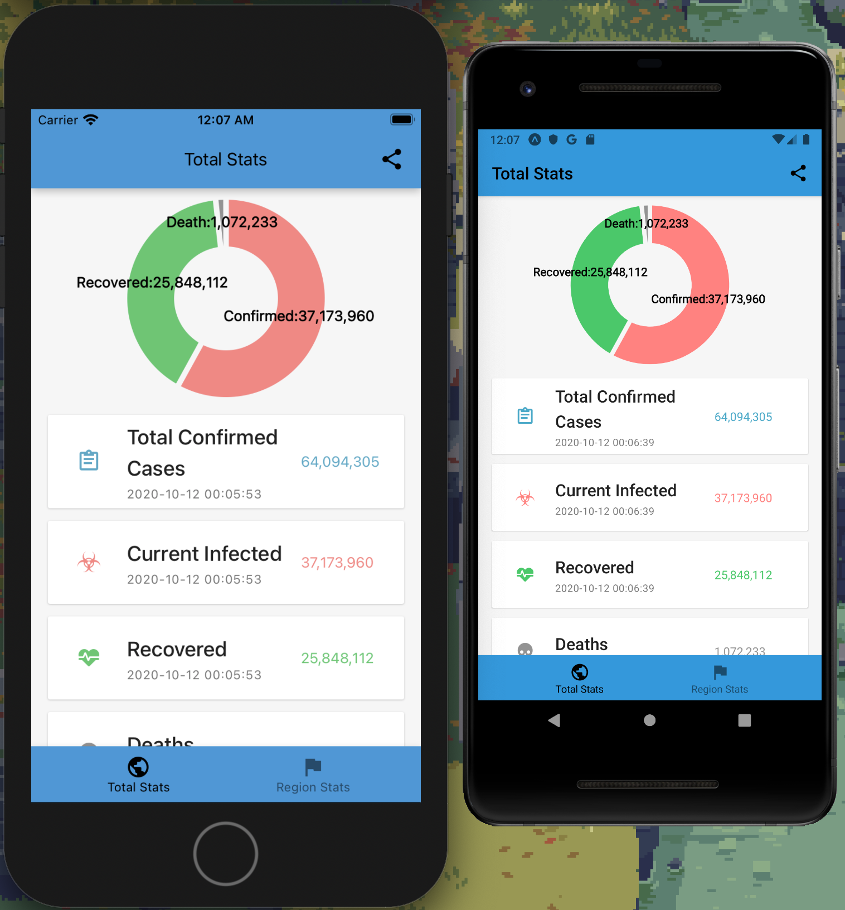

## Corona Cases Report

A simple app fetch https://api.covid19api.com and display it for a challenge.

#### Spec

- React Native/Expo
- Typescript
- Nodejs LTS (12.x)
- Redux/Redux toolkit

#### Screenshots



[demo](./screenshots/demo.mp4)

#### Run with expo client

- [Android Client](https://play.google.com/store/apps/details?id=host.exp.exponent&referrer=www)
- [iOS Client](https://itunes.apple.com/app/apple-store/id982107779)
- [Project url](https://expo.io/@ike.chang/projects/corona-cases-report)

#### Run with snack

- TBD

#### Run locally

```
# Install
yarn global add expo-cli
yarn

# Run on ios
yarn ios
# Run on android
yarn android
```
